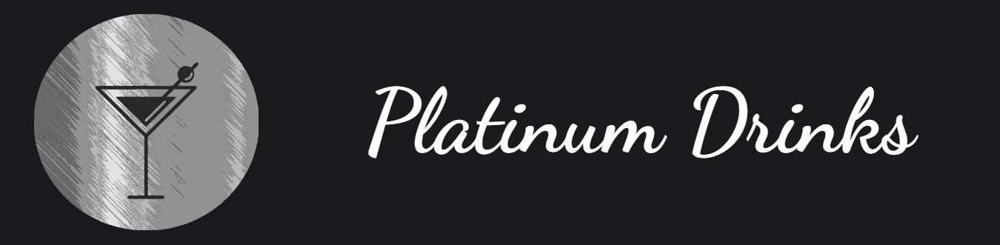
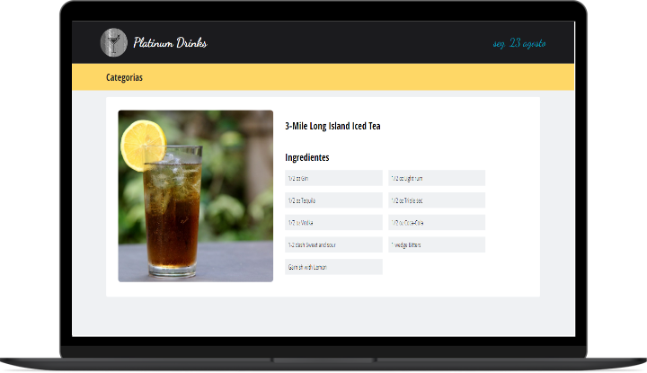
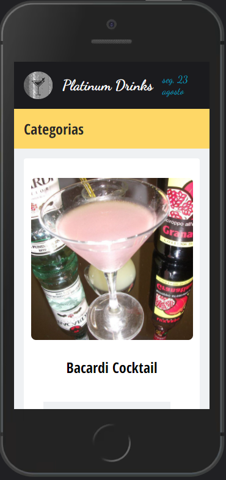

<h1 align=center> Platinum Drinks 🍸 </h1> 
<p align=center>
  
</p>

  <h1 align="center">  
    <a href="https://www.typescriptlang.org/" target="_blank"  rel="noopener noreferrer" >
      
    </a>
    <a href="https://pt-br.reactjs.org/docs/getting-started.html" target="_blank"  rel="noopener noreferrer">
      
    </a>
    <a href="https://code.visualstudio.com/" target="_blank"  rel="noopener noreferrer">
      
    </a>
     <a href="https://github.com/styled-components">
      
    </a>
   </h1>

<h6 align=center>
  <a href="#notebook-about">About</a>&nbsp;&nbsp;&nbsp;|&nbsp;&nbsp;&nbsp;
  <a href="#hammer-technologies">Technologies</a>&nbsp;&nbsp;&nbsp;|&nbsp;&nbsp;&nbsp;
  <a href="#black_nib-getting-started">Getting Started</a>&nbsp;&nbsp;&nbsp;|&nbsp;&nbsp;&nbsp;
  <a href="#hammer-technologies">Technologies</a>&nbsp;&nbsp;&nbsp;|&nbsp;&nbsp;&nbsp;
  <a href="#bangbang-tech-pendencies">Tech Pendencies</a>&nbsp;&nbsp;&nbsp;|&nbsp;&nbsp;&nbsp;
  <a href="#heavy_plus_sign-upgrades">Upgrades</a>
</h6>

# :notebook: About

The **Platinum Drinks** is the best place to learn about your favorites drinks :D

You can look on: https://platinum-drinks.netlify.app/

Presently this app only works with filter categories, other features will be implemented soon.

**Technically we have one page with Drink Categories that once one selected must bring all drinks that it have, and when clicked it must be moved to your details page.

Application made based on challenge test requested by [Ubistart](https://ubistart.com/).

<div align="center">
    
    
</div>

# :hammer: Technologies

#### 📃 Dependencies: -> <i><kbd> [package.json](./package.json) </kbd></i>

- [x] <b>[Typescript](https://www.typescriptlang.org/):</b> <i>It's written in TypeScript</i>
- [x] <b>[Axios](https://github.com/axios/axios):</b> <i>Best lib to work with Promise-based HTTP client </i>
- [x] <b>[Styled-components](https://styled-components.com/):</b> <i>Personal choice for application styles</i>
- [x] <b>[Date FNS](https://date-fns.org/):</b> <i>Beste date utility library </i>
- [x] <b>[TheCockTailDB](https://www.thecocktaildb.com/api.php):</b> <i>Public API used to fetch data </i>


# :black_nib: Getting Started

If you want to run this app on your dev workspace, look that:

You must have installed:

1. **Node.js**. <i>[Here](https://nodejs.org/en/)</i>
2. **GIT**. <i>[Here](https://git-scm.com)</i>

After that, go to the terminal and execute those steps:

```bash
  $ git clone https://github.com/gamadv/platinum-drinks.git
  cd platinum-drinks
```

Downloading dependencies:

```bash
  $ npm install

  # or

  $ yarn
```

:fire: Once dependencies download, just run your start command :

```bash
  $ npm start

  # or

  $ yarn start
```

Expected behaviour:


# :bangbang: Tech Pendencies:

Some features didn't have implemented, so this app are being missing those points:
- [ ] Context API feature;
- [ ] Some block codes missing typings;
- [ ] Search drinks by name
- [ ] Bring on ingredients images


# :heavy_plus_sign: Upgrades:

Some features are available to upgrade this app, those are:

- [ ] Fix some points Responsive Layout;
- [ ] Use localstorage for data local persistence;
- [ ] Create test files for best dev experience

<p align=center> 
  <h6 align=center>💙 Made by</h6> 
  <h2 align=center>
  <a href="https://www.linkedin.com/in/gama-leal">  Moacir Gama
    
  </a>
  </h2>
</p>
